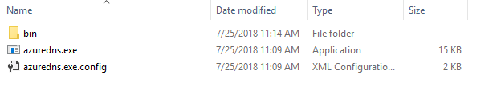
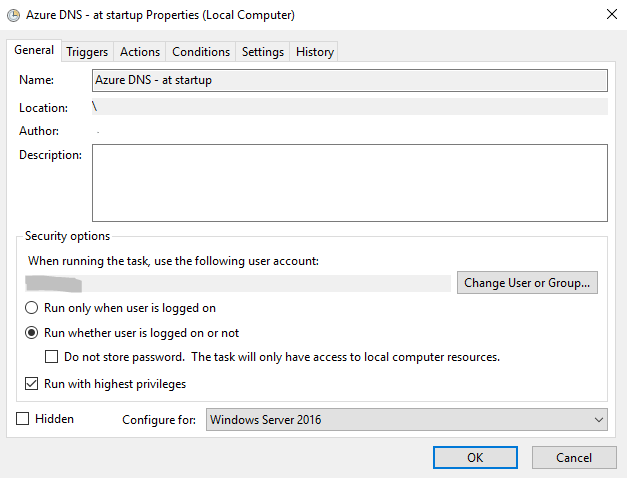
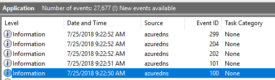

Dynamic DNS in Azure (for Windows)
===

# Background

This solution helps you to update your home server public IP dynamically. This is an alternative for NO-IP (where you have to confirm your host every 30 days). Here you don't need to confirm your host settings in a central surface.

This is not 100% free. The monthly cost in case of a "Pay-AS-YOU-GO" subscription is about **1 EUR/month**.

# Changelog

## v18.7.0

* Can update dns zone in Azure
* Writes events to eventlog
* Manual **Task scheduler** configuration is required


# Prerequisites

* Windows (tested on Windows Server 2016)
* .NET Framework 4.6.1
* Azure subscription
* [Azure DNS zone](https://docs.microsoft.com/en-us/azure/dns/dns-zones-records)

# Installation

1. Pull the solution from my git
2. Rebuild the solution or download the latest release from [here](releases). Then copy the files to their final place. 



3. Create a Service Principal for your account. [More information is here.](http://www.the1bit.hu/technical-thursday-azure-resources-with-ansible/#create-service-principal)
4. Edit configuration file (**azuredns.exe.config**)
``` xml 
<?xml version="1.0" encoding="utf-8"?>
<configuration>
  ...
  <appSettings>
    <add key="zoneName" value="domain name"/>
    <add key="aRecordName" value="subdomain"/>
    <add key="dnsResourceGroup" value="DNS Zone resource group"/>
    <add key="azure.cloudName" value="AzureCloud"/>
    <add key="azure.clientID" value="Service Principal ID"/>
    <add key="azure.clientSecret" value="Service Principal Secret"/>
    <add key="azure.tenant" value="Tenant ID"/>
    <add key="azure.subscriptionID" value="Subscription ID"/>
  </appSettings>
</configuration>
```
5. Save configuration file
6. Configure in **Task scheduler** according to your update requirement (**Important: Local admin privileges required for very first execution**)



7. Wait for the required time then check **Application** EventLong



# Error codes

Here you can find the related error codes.
[errorcodes.md](doc/errorcodes.md)

# Other

Feel free to get in touch if you ave any questions or you need some help.

